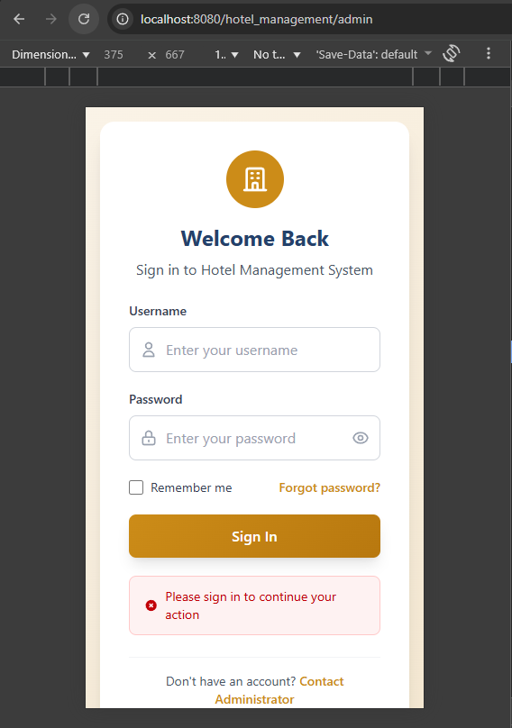

# Hotel Management Project

## Issues Encountered and Solutions
- **Image Path Error:** Some places used public/images instead of public/image, causing images not to display. Fixed by correcting all paths to match the folder structure.
- **ClassNotFoundException: com.microsoft.sqlserver.jdbc.SQLServerDriver Error:** Please add jdbc.jar to the lib of tomcat. Because i use pool connection and it managed by tomcat.

## Notes
- You must use  session="false" in jsp file to avoid container (Tomcat) create session when load JSP
- Ex: 
```<%@ page contentType="text/html;charset=UTF-8" language="java" session="false" %>```
- I don't want auto create session, because i create a authentication filter to check login status by check exist session id in browser. If you haven't login, you will be redirect to login page with a error message.
- You should test in anonymous tab, beacause some browser have Session Restore feature.


---
**Author:** Thuận Đẹp Trai
